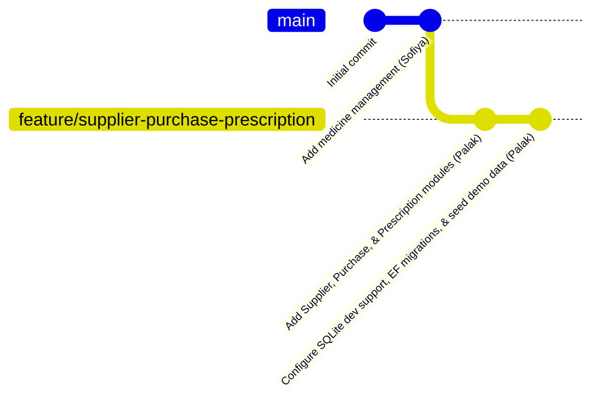
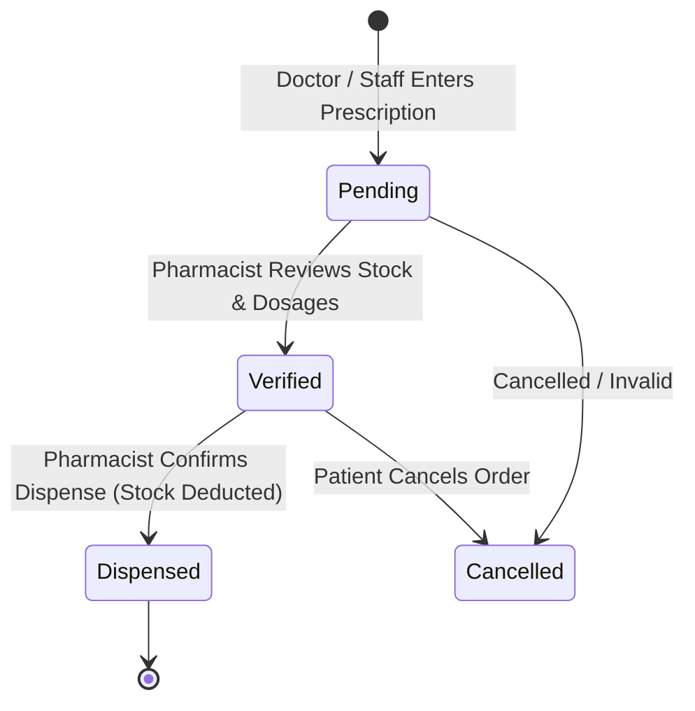
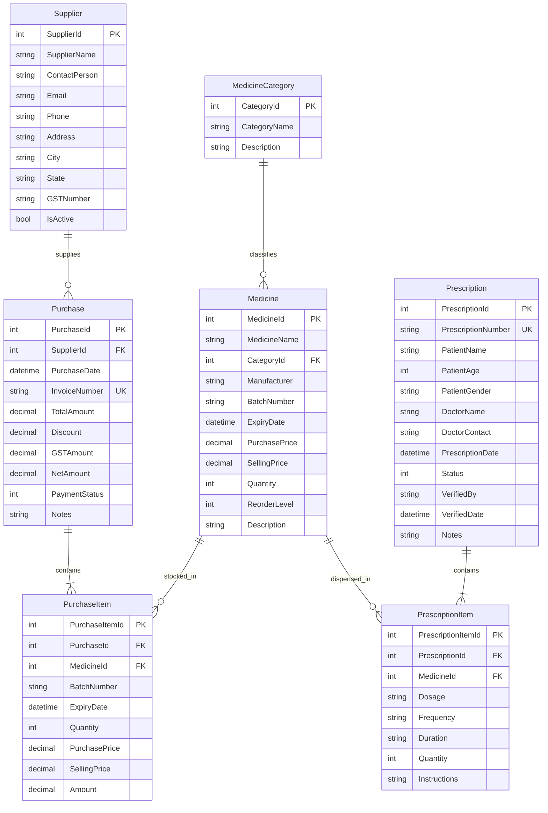

# AI-Powered Pharmacy Management System

> **Enterprise-Grade ASP.NET Core 10 MVC & Entity Framework Core 10 Solution**  
> Comprehensive pharmacy operations platform managing medicine inventories, vendor relationships, procurement workflows, prescription validations, and inventory-synchronized dispensing.

---

## 📌 Table of Contents

1. [Executive Summary & Domain Overview](#-executive-summary--domain-overview)
2. [Collaborative Project Context](#-collaborative-project-context)
3. [Technology Stack & Architectural Overview](#-technology-stack--architectural-overview)
4. [System Architecture & Core Modules](#-system-architecture--core-modules)
   - [1. Medicine & Inventory Management](#1-medicine--inventory-management)
   - [2. Supplier Management](#2-supplier-management)
   - [3. Purchase Management & Invoicing](#3-purchase-management--invoicing)
   - [4. Prescription Lifecycle & Safe Dispensing](#4-prescription-lifecycle--safe-dispensing)
5. [Database Architecture & Entity Relationships](#-database-architecture--entity-relationships)
   - [Entity Relationship Diagram (ERD)](#entity-relationship-diagram-erd)
   - [Relational Integrity & Business Constraints](#relational-integrity--business-constraints)
6. [Dual-Database Setup & Development Seeder](#-dual-database-setup--development-seeder)
7. [Unit Testing Suite & Code Quality](#-unit-testing-suite--code-quality)
8. [Directory Structure](#-directory-structure)
9. [Getting Started & Local Execution Guide](#-getting-started--local-execution-guide)
10. [Step-by-Step Feature Demonstration Script](#-step-by-step-feature-demonstration-script)
11. [Authors & Contribution Breakdown](#-authors--contribution-breakdown)

---

## 🏥 Executive Summary & Domain Overview

The **Pharmacy Management System** is a mission-critical web application designed for retail and hospital pharmacies to streamline daily pharmaceutical operations. It addresses key operational challenges in the pharmaceutical supply chain:

- **Inventory Accuracy & Expiry Tracking**: Prevents drug shortages, tracks batch numbers, monitors expiry dates, and alerts when stocks drop below reorder thresholds.
- **Vendor Procurement & Audit Trails**: Automates supplier interactions, invoices, multi-item purchase entries, and financial tracking (subtotals, discounts, GST, and net payable amounts).
- **Patient Safety & Prescription Verification**: Enforces a strict multi-step clinical validation workflow (Pending $\to$ Verified $\to$ Dispensed) ensuring that drugs are reviewed by licensed pharmacists, verified against physical stock, and deducted atomically from inventory upon dispensing.

---

## 🤝 Collaborative Project Context

This repository is developed cooperatively across structured feature branches. The project lifecycle and contributions are mapped out as follows:



### Contribution Breakdown:

| Contributor | Branch / Scope | Core Responsibilities |
| :--- | :--- | :--- |
| **Sofiya Chavarekar** | `origin/main` | **Base Medicine Catalog**: Medicine categories, medicine CRUD, initial EF Core migration (`InitialMedicineManagement`), and standard Razor layout. |
| **Palak Mangal** | `feature/supplier-purchase-prescription` | **Complete Procurement & Clinical Suite**: Supplier management, purchase entry with dynamic line items, invoice generation, stock auto-addition/reversal, prescription verification and dispensing engine, patient medical history, EF migration (`AddSupplierPurchasePrescription`), SQLite dual-provider support, demo data seeder, and comprehensive 24-test xUnit suite. |

---

## 💻 Technology Stack & Architectural Overview

- **Framework**: ASP.NET Core 10.0 (Target Framework: `net10.0`)
- **Language**: C# 13 (Nullable Reference Types, Implicit Usings, Top-Level Statements)
- **Architecture Pattern**: Model-View-Controller (MVC) with Repository-free EF Core unit-of-work
- **ORM**: Entity Framework Core 10.0.11
- **Database Support**:
  - **Local Development**: SQLite (`Microsoft.EntityFrameworkCore.Sqlite`) with zero external service requirements on macOS/Linux.
  - **Production / Windows**: Microsoft SQL Server / LocalDB (`Microsoft.EntityFrameworkCore.SqlServer`).
- **Frontend / UI**:
  - Razor View Engine (`.cshtml`)
  - Twitter Bootstrap 5.3 (Responsive Grid, Modals, Badges, Dropdown Navbars)
  - Vanilla ES6 JavaScript (Dynamic table manipulation, line item re-indexing)
  - jQuery 3.6+ & jQuery Validation Unobtrusive
- **Automated Testing**:
  - xUnit 2.9.3
  - Microsoft.NET.Test.Sdk 17.14.1
  - EF Core In-Memory Database Provider (`Microsoft.EntityFrameworkCore.InMemory`)

---

## ⚙️ System Architecture & Core Modules

### 1. Medicine & Inventory Management
- **Controllers**: `MedicinesController`, `MedicineCategoriesController`
- **Models**: `Medicine`, `MedicineCategory`
- **Capabilities**:
  - Medicine classification by therapeutic category (Antibiotics, Analgesics, etc.).
  - Real-time stock level monitoring against `ReorderLevel`.
  - Batch number and manufacturer association.
  - Automated stock tracking updated dynamically through purchase additions and prescription dispensings.

---

### 2. Supplier Management
- **Controller**: `SuppliersController`
- **Model**: `Supplier`
- **Capabilities**:
  - **Full CRUD**: Create, read, edit, delete, and list pharmaceutical vendors.
  - **Comprehensive Profile**: Contact persons, corporate email, phone, postal address, city, state, and official GST identification.
  - **Search Engine**: Live search across supplier name, city, GST number, or contact person.
  - **Purchase History Count**: Supplier details page dynamically tallies and displays all historical purchase orders tied to the vendor.
  - **Referential Integrity & Delete Protection**: Implements hard safety checks in both controller logic and database constraints (`DeleteBehavior.Restrict`). A supplier cannot be deleted if active purchase orders reference their record, preventing broken audit logs.

---

### 3. Purchase Management & Invoicing
- **Controller**: `PurchasesController`
- **Models**: `Purchase`, `PurchaseItem`
- **Capabilities**:
  - **Dynamic Line-Item Entry**: Users can add or remove any number of medicine line items dynamically on the UI via client-side JavaScript. Input fields are dynamically re-indexed (`PurchaseItems[i].PropName`) for standard ASP.NET model binding.
  - **Financial Calculations**: Automatically computes each item amount ($\text{Quantity} \times \text{PurchasePrice}$), order subtotal, applies invoice-level discount, adds GST, and determines net payable balance.
  - **Atomic Stock Synchronization**: Uses database transactions (`BeginTransactionAsync`). When a purchase is saved:
    1. The purchase header and line items are stored.
    2. The medicine inventory is automatically incremented ($\text{Quantity} += \text{PurchasedQty}$).
    3. Batch numbers, expiry dates, purchase prices, and selling prices are synced to the inventory table.
  - **Stock Reversal on Deletion**: Deleting a purchase transaction automatically deducts the previously added stock ($\text{Quantity} = \max(0, \text{Quantity} - \text{ItemQty})$) inside an atomic transaction before removing the records.
  - **Printable Invoices**: Dedicated print-friendly template at `/Purchases/Invoice/{id}` styled with `@media print` CSS for physical or PDF receipt generation.

---

### 4. Prescription Lifecycle & Safe Dispensing
- **Controller**: `PrescriptionsController`
- **Models**: `Prescription`, `PrescriptionItem`, `PrescriptionStatus`
- **Workflow State Machine**:



- **Capabilities**:
  - **Auto-Generated Prescription Codes**: Generates standardized identifiers formatted as `RX-YYYYMMDD-XXXX` (e.g., `RX-20260828-0001`), sequentially calculated per calendar day.
  - **Clinical Verification Stage**: Pharmacists access a dedicated verification interface (`/Prescriptions/Verify/{id}`) displaying prescribed quantities alongside live available inventory:
    - Displays green **Available** badges if stock suffices.
    - Displays red **Insufficient** warnings if required quantity exceeds stock.
    - Prompts the pharmacist to record their identity (`VerifiedBy`) and timestamp (`VerifiedDate`).
  - **Transactional Stock Deduction**:
    - Prescriptions can only be dispensed if in `Verified` status.
    - Validates real-time inventory immediately prior to dispensing.
    - Automatically deducts prescribed quantities from inventory within an atomic database transaction.
    - Transitions prescription status to `Dispensed`.
  - **Patient Medical History**:
    - Dedicated portal (`/Prescriptions/History?patientName=...`) listing all chronological prescriptions, prescribed medicines, dosages, frequencies, instructions, and statuses for any patient.

---

## 🗄️ Database Architecture & Entity Relationships

### Entity Relationship Diagram (ERD)



### Relational Integrity & Business Constraints

Configured in [`ApplicationDbContext.cs`](file:///Users/palak/Documents/Mp_online/AI-Powered-Pharmacy-Management-System/Data/ApplicationDbContext.cs):
1. **Unique Indexes**:
   - `Purchase.InvoiceNumber` must be unique across all suppliers.
   - `Prescription.PrescriptionNumber` must be unique across all patient records.
2. **Cascade Deletions**:
   - Deleting a `Purchase` cascades and removes all linked `PurchaseItem` records.
   - Deleting a `Prescription` cascades and removes all linked `PrescriptionItem` records.
   - Deleting a `MedicineCategory` cascades to associated `Medicine` records.
3. **Restrict Deletions**:
   - A `Supplier` cannot be deleted if referenced by any `Purchase`.
   - A `Medicine` cannot be deleted if referenced by any historical `PurchaseItem` or `PrescriptionItem`.

---

## 🔄 Dual-Database Setup & Development Seeder

To allow developers on macOS/Linux to run the project out-of-the-box without installing SQL Server or Docker, the application employs a dual-provider strategy configured in [`Program.cs`](file:///Users/palak/Documents/Mp_online/AI-Powered-Pharmacy-Management-System/Program.cs):

```csharp
var connectionString = builder.Configuration.GetConnectionString("DefaultConnection") ?? "";

builder.Services.AddDbContext<ApplicationDbContext>(options =>
{
    if (connectionString.Contains(".db") || 
       (connectionString.StartsWith("Data Source=", StringComparison.OrdinalIgnoreCase) && !connectionString.Contains(";")))
    {
        options.UseSqlite(connectionString);
    }
    else
    {
        options.UseSqlServer(connectionString);
    }
});
```

### Automated Seeding ([`Data/DbInitializer.cs`](file:///Users/palak/Documents/Mp_online/AI-Powered-Pharmacy-Management-System/Data/DbInitializer.cs))
When the application starts in development, `DbInitializer.Initialize(context)`:
1. Calls `context.Database.EnsureCreated()` to create the schema if missing.
2. If empty, populates:
   - **4 Medicine Categories** (Antibiotics, Analgesics, Antihistamines, Cardiovascular).
   - **4 Medicines** with stock levels, batch numbers, and pricing.
   - **3 Commercial Suppliers** with Indian GST numbers and contact details.
   - **1 Sample Purchase & Invoice** (`INV-2026-0801`).
   - **3 Staged Prescriptions**:
     - `RX-20260828-0001` (Pending) $\to$ Ready for the verification workflow demonstration.
     - `RX-20260828-0002` (Verified) $\to$ Ready for the one-click dispense demonstration.
     - `RX-20260814-0001` (Dispensed) $\to$ Ready for the patient history lookup demonstration.

---

## 🧪 Unit Testing Suite & Code Quality

The automated test suite is built on **xUnit** using an isolated in-memory EF Core database provider per test.

### Test Projects:
- Project file: [`Tests/PharmacyManagementSystem.Tests.csproj`](file:///Users/palak/Documents/Mp_online/AI-Powered-Pharmacy-Management-System/Tests/PharmacyManagementSystem.Tests.csproj)
- Total Test Count: **24 Automated Unit Tests**

```text
Passed!  - Failed: 0, Passed: 24, Skipped: 0, Total: 24 (Duration: ~330ms)
```

### Test Coverage Highlights:
- **`SuppliersControllerTests` (11 Tests)**:
  - List retrieval & keyword filtering.
  - Detail lookups with active purchase tallies.
  - Model validation on Create & Edit.
  - Delete prevention when purchases exist (`DeleteConfirmed_BlocksDeletion_WhenSupplierHasPurchases`).
  - Delete authorization when purchases are absent (`DeleteConfirmed_DeletesSupplier_WhenNoPurchases`).
- **`PurchasesControllerTests` (7 Tests)**:
  - Multi-parameter searching (invoice number, supplier name).
  - Dynamic invoice rendering with line-item calculations.
  - Stock increment logic on purchase creation (`Create_Post_SavesPurchaseAndAddsStock`).
  - Automatic inventory reversal on purchase deletion (`Delete_ReversesStockAdditions`).
- **`PrescriptionsControllerTests` (6 Tests)**:
  - Sequential prescription number generation.
  - Status transition validation (Pending $\to$ Verified).
  - Stock threshold guard: Dispense blocks if inventory is insufficient (`Dispense_FailsIfInsufficientStock`).
  - Transactional inventory deduction on dispense (`Dispense_DeductsStockFromMedicines`).
  - Patient history query filtering.

---

## 📁 Directory Structure

```text
AI-Powered-Pharmacy-Management-System/
├── Controllers/
│   ├── HomeController.cs                   # Landing & Error pages
│   ├── MedicineCategoriesController.cs     # Category management
│   ├── MedicinesController.cs              # Medicine catalog & stock tracking
│   ├── PrescriptionsController.cs          # Prescription lifecycle & dispensing
│   ├── PurchasesController.cs              # Procurement, invoicing, & inventory sync
│   └── SuppliersController.cs              # Vendor management & delete protection
├── Data/
│   ├── ApplicationDbContext.cs             # EF Core DbSets, fluent constraints, & relationships
│   └── DbInitializer.cs                    # Schema bootstrapping & demo seeder
├── Migrations/
│   ├── 20260818141614_InitialMedicineManagement.cs
│   ├── 20260827190052_AddSupplierPurchasePrescription.cs
│   └── ApplicationDbContextModelSnapshot.cs
├── Models/
│   ├── ErrorViewModel.cs
│   ├── Medicine.cs                         # Medicine entity with pricing & stock levels
│   ├── MedicineCategory.cs                 # Therapeutic classification
│   ├── PaymentStatus.cs                    # Enum: Pending, Paid, Partial
│   ├── Prescription.cs                     # Prescription header with patient/doctor metadata
│   ├── PrescriptionItem.cs                 # Prescribed drugs, dosage, frequency, quantity
│   ├── PrescriptionStatus.cs               # Enum: Pending, Verified, Dispensed, Cancelled
│   ├── Purchase.cs                         # Purchase header, totals, discount, GST, net amount
│   ├── PurchaseItem.cs                     # Purchase line item, batch, expiry, unit price
│   └── Supplier.cs                         # Vendor entity with contact details & GST
├── Properties/
│   └── launchSettings.json                 # Ports & environment configurations (5164 / 7015)
├── Tests/
│   ├── PharmacyManagementSystem.Tests.csproj
│   ├── PrescriptionsControllerTests.cs     # 6 unit tests for prescriptions
│   ├── PurchasesControllerTests.cs         # 7 unit tests for purchases & stock sync
│   └── SuppliersControllerTests.cs         # 11 unit tests for suppliers
├── Views/
│   ├── Home/
│   ├── MedicineCategories/
│   ├── Medicines/
│   ├── Prescriptions/                      # Create, Details, Index, Verify, History, Delete
│   ├── Purchases/                          # Create, Details, Index, Invoice (Printable), Delete
│   ├── Shared/
│   │   ├── _Layout.cshtml                  # Navbar with dropdown navigation
│   │   └── _ValidationScriptsPartial.cshtml
│   └── Suppliers/                          # Create, Details, Edit, Index, Delete
├── wwwroot/                                # CSS, JavaScript, and Bootstrap assets
├── appsettings.Development.json            # Local dev config (SQLite connection string)
├── appsettings.json                        # Default / production config (SQL Server)
├── PharmacyManagementSystem.csproj         # Core project manifest & dependencies
└── info.readme.md                          # Comprehensive project documentation
```

---

## 🚀 Getting Started & Local Execution Guide

### Prerequisites
- **.NET 10 SDK** (v10.0.400 or newer)
- **Entity Framework Core CLI Tool** (`dotnet-ef`)

To verify:
```bash
dotnet --version
dotnet-ef --version
```

### Installation & Run Steps

1. **Clone the Repository**:
   ```bash
   git clone https://github.com/Sonali1554/AI-Powered-Pharmacy-Management-System.git
   cd AI-Powered-Pharmacy-Management-System
   git checkout feature/supplier-purchase-prescription
   ```

2. **Restore Dependencies**:
   ```bash
   dotnet restore
   ```

3. **Execute the Automated Test Suite**:
   ```bash
   dotnet test Tests/PharmacyManagementSystem.Tests.csproj
   ```

4. **Run the Application**:
   ```bash
   dotnet run --launch-profile http
   ```

5. **Access the Application**:
   Open your browser and navigate to:
   ```
   http://localhost:5164
   ```

---

## 🎬 Step-by-Step Feature Demonstration Script

Follow this script to demonstrate the features implemented on the `supplier-purchase-prescription` branch:

### Step 1: Code Verification & Automated Tests
In the terminal, run:
```bash
dotnet test Tests/PharmacyManagementSystem.Tests.csproj
```
Highlight that **all 24 tests pass**, ensuring that business logic, database transactions, stock calculations, and edge cases are verified.

### Step 2: Supplier Module
1. Navigate to **Suppliers $\to$ All Suppliers** (`/Suppliers`).
2. Search by vendor or city using the search bar (e.g. search `Mumbai`).
3. Click **Details** on *Apex Pharma Distributors* to show the linked purchase count (`1 purchase`).
4. Click **Delete** on *Apex Pharma Distributors* to demonstrate the delete-protection warning banner preventing deletion of suppliers with active transactions.
5. Navigate to **Suppliers $\to$ Add Supplier** (`/Suppliers/Create`) to create a new vendor record.

### Step 3: Purchase Management & Stock Synchronization
1. Navigate to **Purchases $\to$ All Purchases** (`/Purchases`).
2. Click **Print Invoice** on invoice `INV-2026-0801` (`/Purchases/Invoice/1`) to display the print-ready invoice with GST calculations.
3. Navigate to **Purchases $\to$ New Purchase** (`/Purchases/Create`):
   - Select a supplier and input an invoice number.
   - Select *Amoxicillin 500mg*, fill in batch details, and specify quantity `50`.
   - Click the green **+ Add Item** button to show dynamic JavaScript row addition.
   - Select *Paracetamol 650mg* with quantity `100`.
   - Set discounts or GST, then save.
4. Open **Medicines $\to$ All Medicines** (`/Medicines`):
   - Confirm that the inventory quantities of *Amoxicillin* and *Paracetamol* increased automatically.

### Step 4: Prescription Lifecycle & Dispensing
1. Navigate to **Prescriptions $\to$ All Prescriptions** (`/Prescriptions`).
2. Open Prescription `RX-20260828-0001` (Patient: *John Doe*, Status: `Pending`).
3. Click **Verify** (`/Prescriptions/Verify/1`):
   - Point out the verification table checking required quantities against live stock with green **Available** badges.
   - Enter your name in **Verified By** and submit.
   - The status updates to `Verified`.
4. On the details page, click **Dispense**:
   - Confirm the prompt.
   - The system deducts the medicine stock and marks the prescription as `Dispensed`.
   - Check **Medicines** to observe the reduced inventory.
5. Navigate to **Prescriptions $\to$ Patient History** (`/Prescriptions/History`):
   - Search for `John` to view chronological history cards with doctor notes, dosages, and status badges.

---

## 👥 Authors & Contribution Breakdown

| Feature Area | Contributors | Details |
| :--- | :--- | :--- |
| **Medicine & Categories** | Sofiya Chavarekar | Initial architecture, medicine inventory catalog, category classification, and base migrations. |
| **Procurement, Clinical Engine, Testing & DevOps** | Palak Mangal | Supplier CRUD with delete restrictions; purchase entry with dynamic line items & invoice printing; automated inventory sync and reversal; prescription verification and dispensing workflow; patient medical history; dual-database architecture (SQLite/SQL Server); demo data seeder; 24-test xUnit suite; and `AddSupplierPurchasePrescription` migration. |
